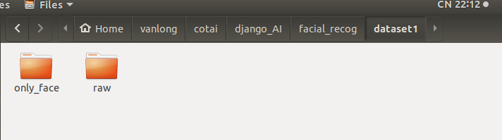
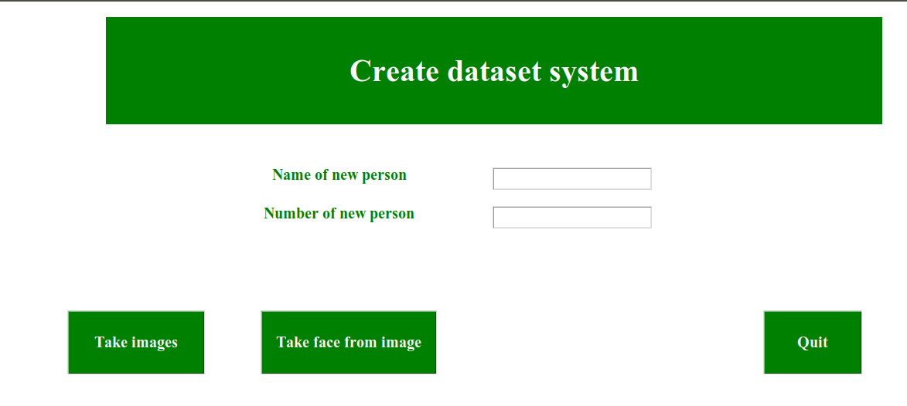

# facial-recognition-python-django
Face detection and facial recognition along with recognized persons information fetched from database.

General Languages and versions

    •	Django version: 1.11.9
    •	OpenCV version: 3.4.0
    •	Sklearn version: 0.19.1

# Collect data:

Dữ liệu được lưu trong thư mục `dataset1`: ta có thể thay đổi tên thư mục tại file `./facial_recog/faceRecog/views.py`.
Trong thực mục `dataset1` gồm 2 phần là:
- `raw` chứa dữ liệu nguyên gốc (ảnh và video)
- `only_face` chỉ chứa khuôn mặt

Để thu thập dữ liệu ta run 

`python3 video_images_faces.py`

Giao diện hiện lên:

Thao tác lấy dữ liệu 1 người mới: ta nhập tên, sđt sau đó click và button `Take image`. Nhấn phím `Q` để dừng việc lấy dư liệu.

Click `Quit` để thoát khỏi chương trình thu thập dữ liệu.

# Chương trình điểm danh

Run 

`python3 manage.py runserver`
